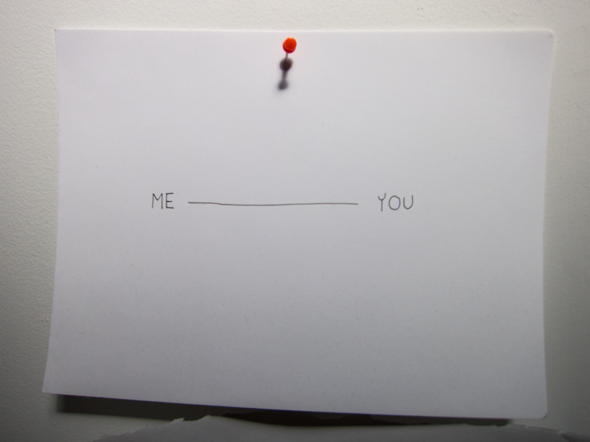
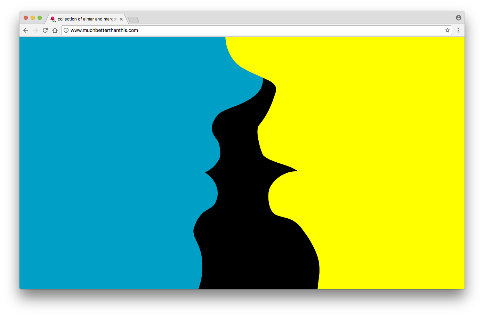
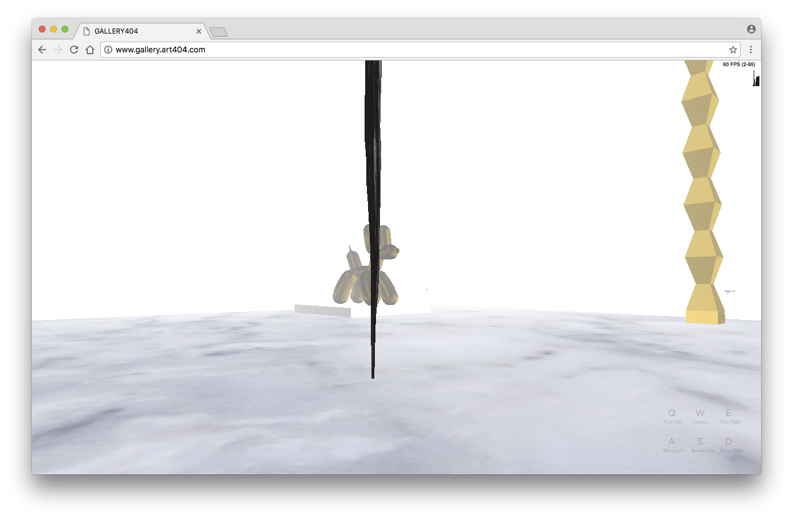
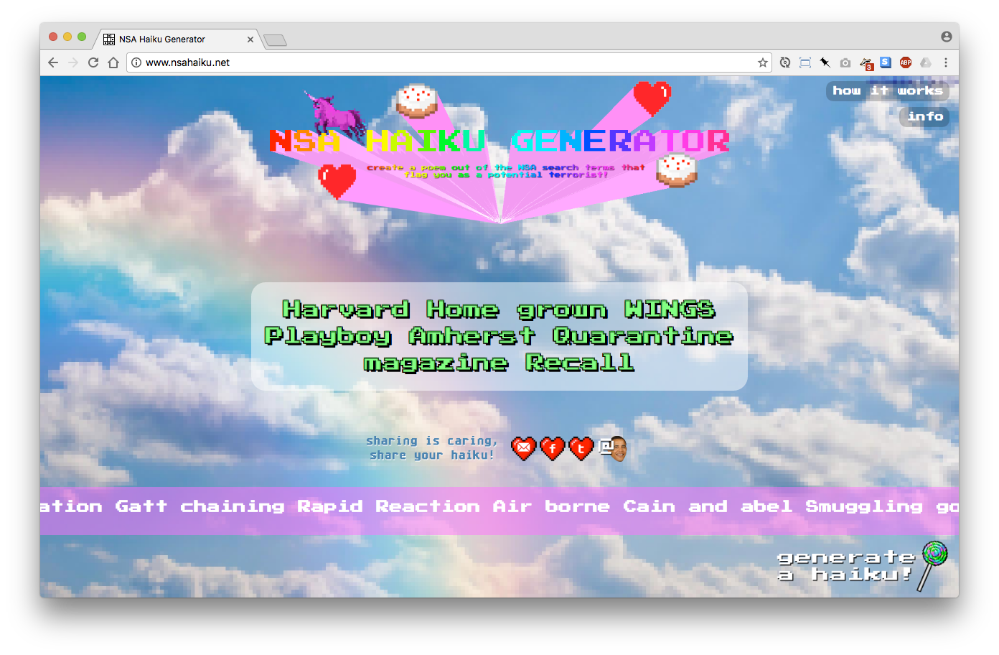
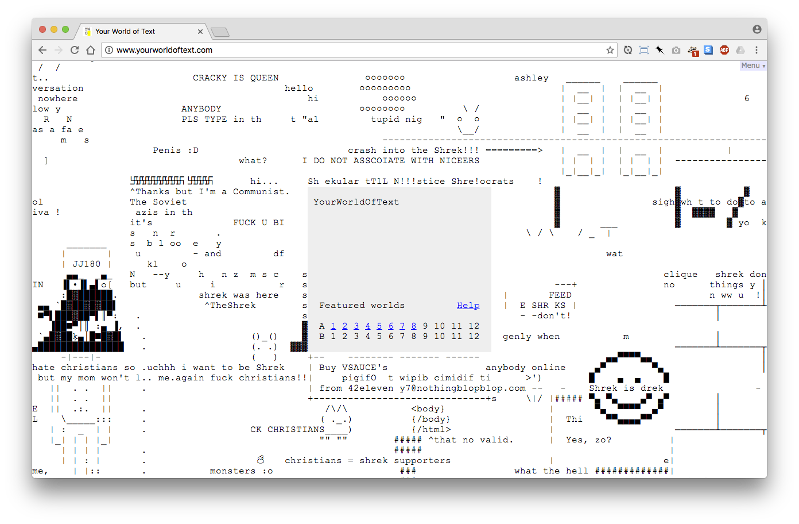

Design II-B
=============

This class is about many things.

 * Learning to **design systems**
 * Learning how to **translate your ideas** to machines and other people
 * Learning **how to learn** about your craft
 * **Having fun** while we're doing it!
    
Let's have a look at [the syllabus](https://docs.google.com/document/d/1cwxx9aWn1HdeqI9jF9a869dTQFoC5qtUhDZKN6fPz6c/edit?usp=drive_web).
    

Some things about me
======================

My name is Andy. I come from Minnesota. I've been doing this stuff for a while. I love to make things & collaborate (lately with [The Notion Collective](http://notioncollective.com/)). I'm looking forward to working with you.




 * [Stairwell intervention](https://www.flickr.com/photos/amdayton/albums/1535190)
 * [Tate Fabrication presents IMPEL](https://vimeo.com/59816748)
 * [The Institute for the Advancement of Metatemporal Education and Research](http://museum.iamer.org)
 * [Hot Air](http://hotairgame.com/)
 * [HRI (Unpaid Internship)](http://notioncollective.com/hri-unpaid-internship/)


Inputs
=======

Werner Herzog, _Low and Behold_


[Rafaël Rozendaal](http://www.newrafael.com/)
[](muchbetterthanthis.com)

[art404, _Gallery404_](http://gallery.art404.com/)
[](http://gallery.art404.com/)

[DIS Magazine, _DIS Images_](http://disimages.com/)
[](http://disimages.com/)

[Grayson Earle, _NSA Haiku Generator_](http://nsahaiku.net/)
[](http://nsahaiku.net/)

[Andrew Badr, _Your World of Text_](http://yourworldoftext.com/)


The web as material
========================

Let's get started learning our craft.

Protocols
---------------

> “I just had to take the hypertext idea and connect it to the TCP and DNS ideas and — ta-da! — the World Wide Web.”
> <cite>— Tim Berners-Lee</cite>


Protocols are essentially sets of rules. In the case of web technology, they're rules for communication between computers. They build on top of eacher to build the web.

<!--
One metaphor we can use for various protocols is a texting convo:
|  Protocol  |  What it actually does |  txt  |
|------------|:-----------------------|:---------------------------|
| TCP/IP     | Ensures that data "packets" get to their destination | "hey did u get my msg?" |
| DNS        | Addressing system that directs packets to their destination | "cn u give me jon's #?" |
| HTTP | Hyper-Text Transfer Protocol. The foundation of the www, rules for transfering web-based data. | "hey im gonna send u some links" |
| HTML | |
-->

* [DNS](https://en.wikipedia.org/wiki/Domain_Name_System) - Domain Name System. An address system for the Internet, that allows packets to find their way to the right place
* [TCP/IP](https://en.wikipedia.org/wiki/Internet_protocol_suite) - A protocols ensures that data "packets" get to their destination.
* [HTTP](https://en.wikipedia.org/wiki/Hypertext_Transfer_Protocol) - Hyper-Text Transfer Protocol. The foundation of the www, rules for transfering web-based data.
* [HTML](https://en.wikipedia.org/wiki/HTML) — Hyper-Text Markup Language. Rules for how to structure hypertext data — in this case a language is just another kind of protocol.

<!--

One metaphor we can use is a texting convo. Say you're trying get an address from a friend-of-a-friend jenny.
 
### DNS
 
 * "hey man cn u send me jennys #'
 * "555-867-5309"
 * "cool thx"
 
### TCP/IP
 
* "hey is this jenny?"
* "yeah who dis?"

### HTTP

* 
-->

**Ta-da!**


Intro to HTML
-------------

For starters, HTML is made up of _tags_, which are keywords contained within the `<` and `>` characters (called "carats"). A few different styles of HTML tags: 

Standard opening opening and closing tags. For example, the text between `<b>` and `<b>` will be bolded:

```html
<b>WHY ARE YOU YELLING AT ME</b>
```

Standalone tags that don't need to be closed. A line break:

```html
Gimme a<br>break
```

Or tags with _attributes_ that add more info to the tag. A link uses the `href` attribute to indicate where it goes:

```html
<a href="http://www.google.com">Google it!</a>
```

### Basic structure

The basic structure of a webpage consists of four tags: `html`, `head`, `body`, and the special `doctype` tag. The tinyest empty web page ever:

```html
<!doctype html>
<html>
<head><head>
<body><body>
</html>
```

What do all of these do?

```html
<!doctype html>
```
Answers the questions: how should I interpret this doc? What language is it? And of course our answer is `html`.

```html
<html></html>
```
Not much goint on here really, except to say that everything in between these tags is HTML.

```html
<head></head>
```

Contains mostly _metadata_, stuff about the page but not necessarily what you see on the page. For example: page title, links to stylesheets, info for Google, Twitter, Facebook, etc. robots to find out more about the page.

```html
<body><body>
```

This is the meat of the web page, where all the content is. 

There are a ton more tags for your HyperText Markup enjoyment! Here's a list from w3schools:

* [HTML Element Reference](http://www.w3schools.com/tags/)

Intro to CSS
-------------

CSS = Cascading Style Sheets. Basically, these tell the browser how your site should look.

Anatomy of a css style:

```css
selector {
  property: value;
}
```

* `selector` is the part that tells you what part of the page to style. "That link over there!" or "All the headers on this page!"
* `property` is the type of style to set. For instance: `color`, `font-family`, `margin`, etc.
* `value` is the actual rule for that style. For `color` it might be `yellow`. For `font-family` it might be `Helvetica`.
* Also, don't forget the `;` at the end!

So let's see some examples:

### Selectors

To select everything between the `<body></body>` tags: 

```css
body
```

To select all the header tags:

```css
h1, h2, h3, h4, h5
```

To select all images that are within paragraphs:

```css
p img
```

### Properties

Ugly red text:

```css
color: red;
```

Set the font to `Georgia`:

```css
font-family: "Georgia";
```

Add a margin of 20 pixels on the left-hand side:

```css
margin-left: 20px;
```

And when we put them together in a stylesheet:

```css

body: {
  color: red;
}

h1, h2, h3, h4, h5 {
  font-family: "Georgia";
}

p img {
  margin-left: 20px;
}

```

There are **tons** of CSS properties, there's no way you could remember them all. w3schools has a reference for this too:

* [CSS Reference](http://www.w3schools.com/cssref/)

Diving in
==========

Next we'll dive in and get started using HTML & CSS.

 1. File systems
 2. [Brackets](http://brackets.io) text editor
 3. Setting up your `art.rutgers.edu` web space
 4. Creating a basic HTML page


For next week
=============

<pre>
Soon we'll be coding
The web and its protocols
Don't forget to save
</pre>

* Read Lev Manovich, [_The Language of New Media_](https://s3.amazonaws.com/2b.andydayton.com/the+language+of+the+new+media_manovich.pdf) (pp. 43–66)
* Pick a favorite website to bring to class. We'll open up the hood and see how it works.
* Select a poem to use when we continue with HTML/CSS next class. A good place to start: [Poetry at Project Gutenberg](https://www.gutenberg.org/wiki/Poetry_%28Bookshelf%29). Or write your own!

